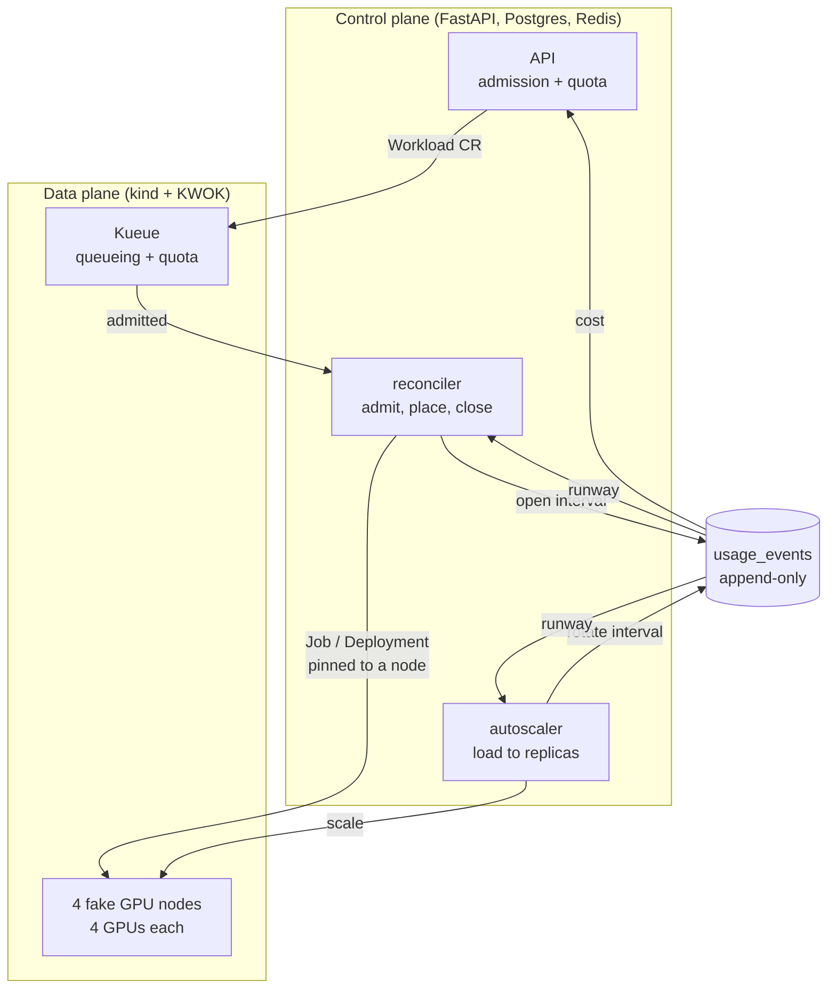

# Kestrel

A multi-tenant GPU compute control plane. Tenants submit **jobs** (run and finish) or provision
**endpoints** (stay up behind a URL) through an API; Kestrel admits them against per-tenant quota,
places them on GPU nodes under a pluggable policy, meters GPU-seconds, enforces budgets, autoscales
endpoints on load, and reports all of it to Prometheus and an operator console.

The distinguishing piece is **runway-aware scheduling**: the same append-only usage ledger that
produces a tenant's bill is also read live by the scheduler and the autoscaler, so a tenant's
remaining budget influences *where and whether* their work runs, not just what they are charged
afterwards.

---

## What is real, and what is simulated

This runs on a laptop, so the GPUs are fake. Nothing else is.

**Simulated.** There is no GPU silicon. The four `kwok-gpu-node-*` nodes are
[KWOK](https://kwok.sigs.k8s.io/) fakes that advertise `nvidia.com/gpu: 4` and have no kubelet:

```
kwok-gpu-node-0   kubelet=(none)   managedBy=fake   nvidia.com/gpu=4
```

Because KWOK fakes the pod lifecycle, containers scheduled onto those nodes never execute. A tenant
pod there reports `phase: Succeeded` with `containerStatuses: [None]` and no container ID. The
autoscaler's demand signal is likewise *reported* through `POST /endpoints/{id}/load` rather than
measured from real traffic.

**Real.** Everything above the hardware. kind runs a genuine Kubernetes API server, etcd, scheduler
and controller-manager. Kueue genuinely admits workloads against real `ClusterQueue` quota. Real
namespaces, `ResourceQuota`, `Job` and `Deployment` objects are created. The control plane is real
software against real Postgres and Redis, and the metering arithmetic is exact:

```
gpus=2   started 19:29:51.307967   ended 04:40:46.255678
gpu_seconds = 66109.895422    recomputed = gpus x elapsed = 66109.8954
```

Every figure in the console and in Prometheus derives from rows like that. Nothing is seeded or
hardcoded.

**The honest caveat.** `GPUs held` is *allocation*, not utilisation. There is no DCGM telemetry, so
`GPU-seconds` means GPU-seconds reserved, not compute performed. Billing on allocation is what real
clouds do, but the distinction matters: this project demonstrates scheduling, quota, metering and
autoscaling behaviour, not throughput or utilisation efficiency.

---

## Quickstart

Requires Docker, `kind`, `kubectl`, Python 3.11+ and Node 22+ (plus `jq` for the snippet below).

```bash
# 1. Data plane: kind cluster, KWOK, 4 fake GPU nodes, fake-gpu-operator, Kueue
bash deploy/bootstrap.sh

# 2. Control plane, Prometheus and the console
cd deploy && docker compose up -d --build

# 3. Schema
cd ../control-plane && alembic upgrade head
```

| Service | URL |
| --- | --- |
| Operator console | http://localhost:3000 |
| Control-plane API | http://localhost:8000 |
| Prometheus | http://localhost:9090 |

Ports 5433 and 6380 are used for Postgres and Redis on the host, deliberately off the defaults so a
native Postgres or Redis can keep 5432/6379.

Create a tenant and submit work:

```bash
TOKEN=dev-admin-token
TENANT=$(curl -s -X POST localhost:8000/admin/tenants \
  -H "x-kestrel-admin-token: $TOKEN" -H 'content-type: application/json' \
  -d '{"slug":"research","name":"Research","max_gpus":6,"max_workloads":20,
       "gpu_second_budget":90000,"price_per_gpu_hour":12.5}' | jq -r .id)

KEY=$(curl -s -X POST localhost:8000/admin/tenants/$TENANT/api-keys \
  -H "x-kestrel-admin-token: $TOKEN" | jq -r .key)

curl -s -X POST localhost:8000/jobs -H "x-kestrel-key: $KEY" \
  -H 'content-type: application/json' \
  -d '{"image":"busybox","command":["sleep","60"],"gpus":2}'
```

---

## Architecture



Three processes share one Postgres and no memory: the API server, the reconciler
(`python -m scheduler.reconcile`) and the autoscaler (`python -m autoscale.loop`). The reconciler is
the single writer of workload status after submission. Both loops take a short Redis mutex per tick,
so they cannot double-book a node's GPUs.

### Scheduling is split in two

**Kueue** decides *whether and when* a workload may run, against real per-tenant `ClusterQueue`
quota. That is production-grade queueing logic and is used as-is.

**A custom `PlacementPolicy`** decides *where* an admitted workload lands. Four are implemented and
hot-swappable at runtime through `POST /admin/policy`:

| Policy | Behaviour |
| --- | --- |
| `first_fit` | First node with enough free GPUs |
| `bin_packing` | Tightest fit, keeping whole nodes free for large asks |
| `priority` | Higher priority claims capacity first |
| `runway_fair` | Healthier budget runway drains first |

Placements are all-or-nothing: a multi-GPU workload never gets split across nodes.

---

## Runway-aware scheduling

Every other scheduler treats cost as something you read afterwards. OpenCost and Kubecost derive it
by sampling Prometheus for pod resource requests, so they are structurally downstream of the
scheduler with no write path into admission. Kueue has no concept of currency; KEDA and the HPA
cannot see tenant quota at all.

Kestrel closes that loop. `MeteringStore.runway_for()` is the one place a tenant's runway is computed
from usage history, and the scheduler, the autoscaler and the explain endpoint all call it:

```
runway = (budget - used_gpu_seconds) / GPUs currently held
```

`None` means infinite: no budget configured, or nothing burning it right now. Runway is bucketed into
a risk tier (thresholds 5min / 30min / 6h) so a momentary swing in burn rate cannot reorder the queue.

**In the scheduler.** `RunwayFair` sorts admitted candidates by `(-priority, risk_tier, admitted_at)`.
Explicit priority still wins outright; among equals, the healthier tenant drains first. A candidate
held back for more than 300 seconds is promoted to tier 0 regardless of runway, so runway can delay a
placement but never lock one out.

**In the autoscaler.** `clamp_to_capacity()` gained a third limit beside free node GPUs and quota
headroom: growth is capped at what the tenant's remaining runway can sustain for one horizon. This is
the gate KEDA has no equivalent to, because it has nothing to read a budget from.

**Observed live.** Two tenants, equal priority. The one with 400 GPU-seconds of budget (burning
1 GPU, runway ~372s, tier 2) submitted *first*; an unbudgeted tenant submitted *second*:

| Tenant | Submitted | Runway | Tier | Rank |
| --- | --- | --- | --- | --- |
| low-runway | first | 371.75s | 2 | **1** |
| unbudgeted | second | infinite | 0 | **0** |

Under FIFO the first submitter ranks 0. Under `runway_fair` the healthier tenant's later job goes
first.

### Explaining a decision

`GET /workloads/{id}/explain` reconstructs why a workload is in the state it is, using the same
primitives the real placement path uses (`ClusterState`, `PlacementCandidate`, the active policy,
`QuotaEnforcer.check_placement`) so the explanation cannot diverge from what the reconciler would
actually decide. It creates nothing and writes nothing.

```json
{
  "status": "admitted",
  "quota":    { "passes": false, "reason": "GPU-second budget exhausted (5s); new submissions are blocked" },
  "kueue_admitted": true,
  "ordering": { "rank": 1, "total_admitted": 2, "would_place_on": "kwok-gpu-node-0", "blocked_reason": null },
  "runway":   { "burn_rate_gpus": 1, "remaining_gpu_seconds": "-2.49", "runway_seconds": "0", "risk_tier": 3, "is_exhausted": true }
}
```

That `quota.reason` is character-for-character the message the next real `POST /jobs` returned with
`429`, because both calls run the same enforcer against the same rows.

---

## Metering, quota and billing

Usage is an **append-only ledger**. An interval opens when the reconciler places a workload and
closes when it ends; `record_partial()` rotates it when the autoscaler changes an endpoint's
footprint, so history is never rewritten. Live cost needs no writer at all: `usage_for()` prices open
intervals up to `now` at read time.

Quota is enforced at two points, belt-and-suspenders beside Kueue's own:

- **Admission** rejects an ask larger than the tenant's entire quota (it could never run and would
  wedge the queue) and blocks submissions once the lifetime GPU-second budget is spent.
- **Placement** gates on concurrent GPUs. This is the only gate endpoints get, since they skip Kueue.

`GET /tenants/{id}/usage` returns a live breakdown; `GET /tenants/{id}/billing-report` persists an
append-only snapshot.

## Autoscaling

A custom control loop, chosen over KEDA so the decision logic is owned and testable. Reported load
over a 30-second sliding Redis window becomes a replica target
(`ceil(rps / target_rps_per_replica)`), which is then clamped to what the node, the tenant's quota
and the tenant's budget can actually give.

- Scale-up is immediate; scale-down waits out a stabilization window measured from the last replica
  change, so a brief dip cannot flap an endpoint down and back up.
- `min_replicas: 0` opts into scale-to-zero (Knative's `minScale` semantics). A sleeping endpoint has
  its usage interval *closed* rather than reopened at zero, so cost visibly flatlines.

## Observability

The three control-plane processes share a database but no memory, so a counter incremented in the
reconciler would be invisible on the API's `/metrics`. State metrics are therefore **derived at
scrape time** from Postgres and the cluster by a custom collector, the same derive-on-read stance
`usage_for` takes toward live cost. Only quota rejections, which happen on the API request path and
nowhere else, are a true in-process counter.

```
kestrel_queue_depth{tenant}              kestrel_tenant_gpu_seconds_total{tenant}
kestrel_node_gpu_used{node}              kestrel_tenant_runway_seconds{tenant}
kestrel_node_gpu_total{node}             kestrel_tenant_risk_tier{tenant}
kestrel_autoscale_replicas{endpoint}     kestrel_quota_rejections_total{tenant}
kestrel_scheduling_latency_seconds       kestrel_workload_duration_seconds{kind}
```

Collection degrades per source: an unreachable Postgres drops those series, an unreachable cluster
drops the node series, and `/metrics` still answers 200.

The **operator console** (`dashboard/`, Next.js) renders a GPU map drawn as discrete GPU cells rather
than a utilisation percentage, because fragmentation is what the placement policies exist to manage
and a percentage hides it. Credentials never reach the browser: the admin token stays in the Next.js
server, and tenant data is read with a real per-tenant API key minted through the admin endpoint, so
the console exercises the same path a customer's client would and needs no CORS rules.

---

## API

Auth is `X-Kestrel-Key` for tenant routes and `X-Kestrel-Admin-Token` for admin and cluster routes.

```
POST   /admin/tenants                      create tenant (+ namespace, quota, LocalQueue)
GET    /admin/tenants                      list tenants
POST   /admin/tenants/{id}/api-keys        issue a key
GET    /admin/policy                       active placement policy
POST   /admin/policy                       switch placement policy

POST   /jobs                               submit a job
GET    /jobs  ·  GET /jobs/{id}            list / read
DELETE /jobs/{id}                          cancel

POST   /endpoints                          provision an endpoint
GET    /endpoints  ·  GET /endpoints/{id}  list / read
DELETE /endpoints/{id}                     tear down
POST   /endpoints/{id}/load                report load (drives the autoscaler)
GET    /endpoints/{id}/load                current observed window
GET    /endpoints/{id}/autoscale-events    replica-change audit trail

GET    /workloads/{id}/explain             why this workload is where it is
GET    /tenants/{id}/usage                 live usage + cost
GET    /tenants/{id}/billing-report        persisted billing snapshot

GET    /cluster/nodes                      per-node GPU total/used/free
GET    /cluster/workloads                  all workloads across tenants
GET    /metrics                            Prometheus scrape
GET    /healthz                            live database / Redis / cluster checks
```

---

## Tests

175 tests, split by the infrastructure they actually need:

| Needs | Count | What |
| --- | --- | --- |
| Nothing | 74 | Placement ordering, autoscale decisions, runway and budget arithmetic |
| Postgres + Redis | 85 | Reconcile and autoscale loops against an in-memory `FakeCluster`, metering, quota, billing, the metrics collector, `/explain` |
| Live kind cluster | 16 | Tenant bootstrap, placement, quota and autoscaling through the full stack |

```bash
cd control-plane
python -m pytest ../tests/ -q          # everything
ruff check . ../tests/ && mypy .       # lint + strict types
```

Two things to know before running the whole suite: the compose `reconciler` and `autoscaler` drive
their own ticks and will race the tests, and the live-cluster tests need free GPU capacity, so tear
down running workloads first.

---

## Layout

```
control-plane/
  api/           routers, auth, app
  scheduler/     PlacementPolicy interface + policies, reconcile loop, explain
  economics/     pure runway math (burn rate, remaining, risk tier, budget headroom)
  metering/      append-only usage intervals, runway_for
  quota/         admission, placement and budget enforcement
  autoscale/     load signal, decision policy, scale loop
  cluster/       Kubernetes + Kueue client behind a ClusterPort protocol
  obs/           Prometheus collector
dashboard/       Next.js operator console
deploy/          kind + KWOK + fake-gpu-operator + Kueue setup, docker-compose, Prometheus
scripts/         loadgen
tests/
```

Interfaces are deliberately narrow and pure where possible: `PlacementPolicy`, `MeteringStore`,
`QuotaEnforcer`, `ClusterPort` and `Autoscaler` are each independently testable, which is why 74 of
the tests need no infrastructure at all.
